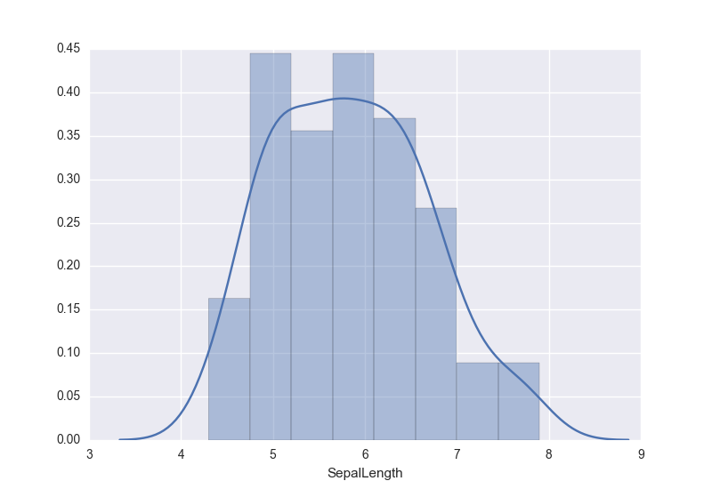
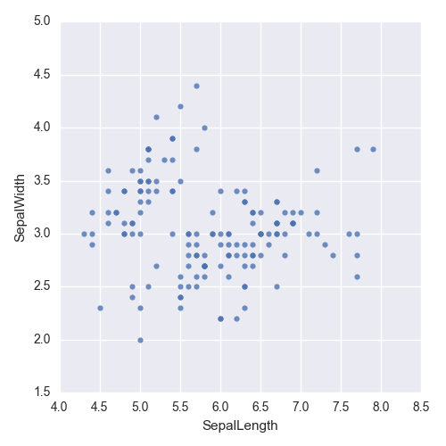
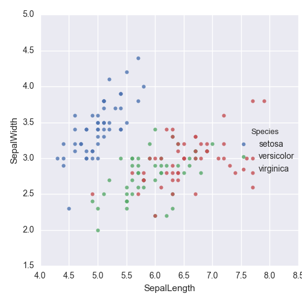
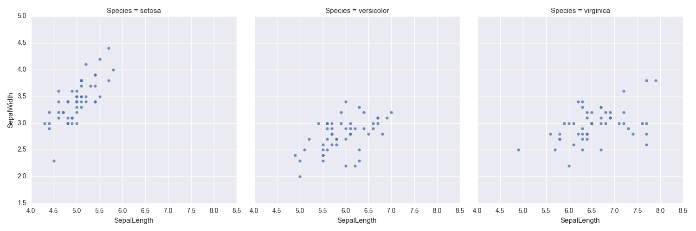
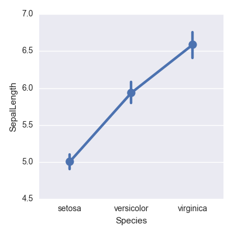
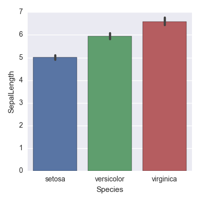
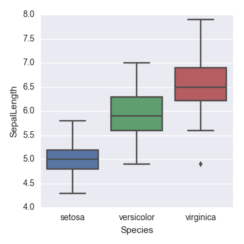
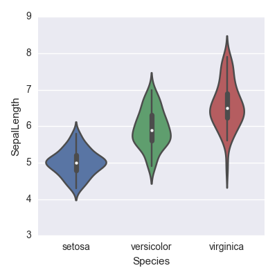

<center></center>

Po is a Python module facilitates analysis of structured data.  It reads in a comma/tab-separated file and allows querying, selection, visualization, clustering and further analysis of the data.

Po is built on top of pandas, scikit-learn, and seaborn.

### Installation

##### Fresh install

1. Install [Anaconda distribution](http://continuum.io/downloads) with Python 3.  Po requires pandas, matplotlib, scikit-learn, and seaborn.  By default, pandas, matplotlib and scikit-learn are installed by anaconda.

2. Install seaborn:  **conda install seaborn**

3. Install po from github:  **pip install git+https://github.com/vtphan/po**

##### Upgrade to the latest version

+ **pip install -U git+https://github.com/vtphan/po**

### Read data

```
import po
iris = po.read_csv("data/iris.csv")
```

*iris* is a po instance, which is a glorified pandas data frame.  Thus, a po instance has access to all utilities available to pandas data frames.

Tab-separated files can also be read easily.
```
indels = po.read_csv("data/indels.txt", sep="\t")
```

### Query and select data

po instances have a *query* method, which wraps around pandas data frame's query method.  Po.query returns a po instance.

```
setosa = iris.query('Species == "setosa" and PetalWidth > 0.1')
```

Selecting columns by giving a list of column names. The return value is a po instance.

```
only_two_cols = iris[["Species", "PetalLength"]]
```

Consult [pandas documentation](http://pandas.pydata.org/pandas-docs/stable/indexing.html) for further information on how to select and query Pandas data frames.

##### Write a po instance (data frame) to file

```
setosa.to_csv("setosa.csv")
setosa.to_csv("setosa.csv", index=False)        # no index column
only_two_cols.to_csv("b.tsv", sep="\t")         # tab separated (default is comma separated)
```

### Linear Regression
Correlate X variables (e.g. petal width and petal length) with a Y variable (e.g. sepal length):

```
iris.Regress("PetalWidth", "PetalLength", "SepalLength")
```

### Classification (supervised learning)
Classify based on X variables (e.g. petal width and petal length) into categories defined by a Y variable (e.g. species):

```
iris.Classify("PetalWidth", "PetalLength", "Species")
```

By default, logistic regression is used.  To use another classification method, users need to specify it explicitly:

```
iris.Classify("PetalWidth", "PetalLength", "Species", method='svm')
```

Currently, supported classifcation methods include logistic regression, linear SVM, decision tree, random forest, naive bayes, gradient descent, and k-nearest neighbors.

Make prediction:
```
iris.model.predict([[0.2,1.4],[2.3,5.0],[1.5,5.0]])
```
This should return the array ['setosa', 'virginica', 'versicolor'].

### Clustering (unsupervised learning)
Cluster rows into 3 clusters based on petal widths and lengths.  Clustering is done using [k-means](http://scikit-learn.org/stable/modules/clustering.html#k-means).  Cluster labels are placed in a new column called *_kmeans_*.

```
iris.Cluster("PetalWidth", "PetalLength", clusters=3)
```

In case the number of clusters is not specified, clustering is done using [meanshift](http://scikit-learn.org/stable/modules/clustering.html#mean-shift).  Cluster labels are placed in a new column called *_meanshift_*.

```
iris.Cluster("PetalWidth", "PetalLength")
```

Other clusterting methods include [hierarchical clustering](http://scikit-learn.org/stable/modules/clustering.html#hierarchical-clustering), [spectral clustering](http://scikit-learn.org/stable/modules/clustering.html#spectral-clustering), and [dbscan](http://scikit-learn.org/stable/modules/clustering.html#dbscan).

```
iris.Cluster("PetalWidth", "PetalLength", method="hierarchical", clusters=3)
```

Show the cluster labels:
```
iris.model.labels_
```
Output:
```
array([1, 1, 1, 1, 1, 1, 1, 1, 1, 1, 1, 1, 1, 1, 1, 1, 1, 1, 1, 1, 1, 1, 1,
       1, 1, 1, 1, 1, 1, 1, 1, 1, 1, 1, 1, 1, 1, 1, 1, 1, 1, 1, 1, 1, 1, 1,
       1, 1, 1, 1, 0, 0, 0, 0, 0, 0, 0, 0, 0, 0, 0, 0, 0, 0, 0, 0, 0, 0, 0,
       0, 0, 0, 0, 0, 0, 0, 0, 2, 0, 0, 0, 0, 0, 2, 0, 0, 0, 0, 0, 0, 0, 0,
       0, 0, 0, 0, 0, 0, 0, 0, 2, 2, 2, 2, 2, 2, 0, 2, 2, 2, 2, 2, 2, 2, 2,
       2, 2, 2, 2, 0, 2, 2, 2, 2, 2, 2, 0, 2, 2, 2, 2, 2, 2, 2, 2, 2, 2, 2,
       0, 2, 2, 2, 2, 2, 2, 2, 2, 2, 2, 2], dtype=int32)
```

Predict:
```
iris.model.predict([[0.2,1.4],[2.3,5.0],[1.5,5.0]])
```

Output (predicted clusters):
```
array([1, 2, 0], dtype=int32)
```

### Visualize data

When one variable (defined by column name) is given, it must be a numerical variable.  The plot is a distribution plot.

```
iris.Plot("SepalLength")
```


When a numerical variable is compared against another numerical variable, the plot is a scatter plot.

```
iris.Plot("SepalLength", "SepalWidth")
```


Colors can be added to differentiate rows with values belonging to a categorical variable.

```
iris.Plot("SepalLength", "SepalWidth", hue="Species")
```


Scatter plot separated into different columns and rows.
```
iris.Plot("SepalLength", "SepalWidth", col="Species")
```


This will produce a vertically oriented plot.
```
iris.Plot("SepalLength", "SepalWidth", row="Species")
```

When a categorical variable is plot against a numerical variable, the plot can be either a *point* plot (default), *bar* plot, *strip* plot, a [*box*plot](https://en.wikipedia.org/wiki/Box_plot), or a [*violin* plot](https://en.wikipedia.org/wiki/Violin_plot).

```
iris.Plot("Species", "SepalLength")
```


```
iris.Plot("Species", "SepalLength", kind="bar")
```


```
iris.Plot("Species", "SepalLength", kind="box")
```


```
iris.Plot("Species", "SepalLength", kind="violin")
```



